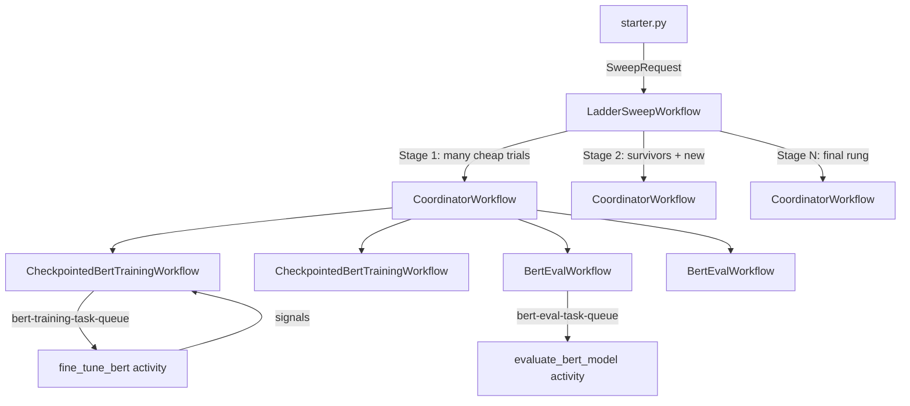

<!--
description: Build durable custom hyperparameter optimization to save money
tags: [ML Ops, HPO, autoML, python]
priority: 700
-->

# Durable Hyperparameter Optimization for BERT Fine-Tuning

This example uses Temporal to orchestrate a **multi-stage hyperparameter sweep** for fine-tuning BERT-family models on text classification tasks (sentiment analysis, citation intent, etc.). The sweep explores learning rate, batch size, sequence length, and epoch count using a TPE-inspired "ladder" schedule that starts many cheap trials, prunes the losers, and promotes the best candidates to longer training runs -- all with full durability so you can kill workers, restart them, and pick up exactly where you left off.

## How it works



**LadderSweepWorkflow** runs multiple stages ("rungs"). Each rung:
1. Promotes the best survivors from the previous rung (more epochs, more data).
2. Proposes new candidates using a TPE-style sampler biased toward good regions.
3. Fans out to **CoordinatorWorkflow**, which starts training + evaluation child workflows.
4. Ranks results by accuracy and selects survivors for the next rung.

## Quickstart

From `ml_ops/hyperparam_optimization/`:

1. **Start Temporal Server** (if not already running):

   ```bash
   temporal server start-dev
   ```

2. **Start the training worker** (GPU / MPS recommended):

   ```bash
   uv sync --dev
   uv run -m training_worker
   ```

3. **Start the orchestration worker** (CPU is fine):

   ```bash
   uv run -m orchestration_worker
   ```

4. **Run a quick demo sweep** (~5 minutes on a MacBook):

   ```bash
   uv run -m starter --config deberta-sst2 --num-trials 4 --max-concurrency 2
   ```

   Or a full sweep (longer, more thorough):

   ```bash
   uv run -m starter --config deberta-sst2 --num-trials 12 --max-concurrency 4
   ```

   Use `--list-configs` to see all available model/dataset combinations.

## Understanding the output

Open the Temporal UI at [http://localhost:8233](http://localhost:8233). Look for the workflow whose ID starts with `bert-ladder-` -- this is the top-level `LadderSweepWorkflow`. Expand its child workflows to see individual training and evaluation runs.

**Expected log output you can ignore:**

The `UNEXPECTED` and `MISSING` key warnings in the console are normal. They come from Hugging Face Transformers loading a pre-trained language model checkpoint into a classification head -- the LM-specific weights (e.g., `lm_predictions.*`) are discarded and a new classification layer (`classifier.*`) is initialized from scratch. This is standard BERT fine-tuning behavior.

**Monitoring training progress:**

- Each training activity sends periodic **heartbeats** visible in the Temporal UI under the activity's details.
- **Checkpoint signals** are sent to the parent workflow whenever the Trainer saves a checkpoint. You can query `get_latest_checkpoint` on any running `CheckpointedBertTrainingWorkflow` to see the most recent loss and step.
- Training loss is logged to the console at regular intervals by the HuggingFace Trainer.

## Where checkpoints and data are stored

- **Model checkpoints:** `./bert_runs/{run_id}/` -- each training run writes its model, tokenizer, and mid-run checkpoints here.
- **Dataset snapshots:** `./data_snapshots/` -- downloaded datasets are saved as JSONL snapshots keyed by content hash for reproducibility.

Both directories are created automatically. They can grow large during a full sweep.

## Durability demo

To see Temporal's durability in action:

1. Start both workers and run the starter as above.
2. Wait until you see training logs from `BertFineTuneActivities` (look for lines mentioning `Starting BERT fine-tuning run`). This typically takes 30-60 seconds after the sweep starts.
3. **Kill the training worker** (Ctrl-C in its terminal).
4. Restart it:

   ```bash
   uv run -m training_worker
   ```

5. Observe in the Temporal UI and logs that:
   - In-flight training children resume from the latest checkpoint.
   - The ladder sweep continues from the last completed stage, not from scratch.
   - The final leaderboard is coherent.

## Scaling out

For production or cloud deployments, training and orchestration workers can run on separate machines. The key requirement is a **shared filesystem** for model checkpoints and dataset snapshots, since the training worker writes to `./bert_runs/` and the evaluation worker reads from it.

Options for shared storage:
- **AWS:** EFS (simple) or FSx for Lustre (high throughput)
- **GCP:** Filestore or Cloud Storage FUSE
- **Azure:** Azure Files or Azure NetApp Files
- **On-prem / Kubernetes:** NFS, CephFS, or any POSIX-compatible shared mount

Alternatively, modify the activities to upload/download checkpoints to object storage (S3, GCS) instead of relying on a shared filesystem.

## Architecture

### Workflow hierarchy

| Workflow | Responsibility |
|---|---|
| `LadderSweepWorkflow` | Multi-stage sweep with TPE-inspired proposal and survivor promotion |
| `SweepWorkflow` | Simpler random sweep (single stage) |
| `CoordinatorWorkflow` | Fan-out training + evaluation for a batch of configs |
| `CheckpointedBertTrainingWorkflow` | Single training run with checkpoint signals and dataset snapshots |
| `BertEvalWorkflow` | Single evaluation run against a saved checkpoint |

### Activities

All ML and I/O code lives in activities (`bert_activities.py`):

| Activity | Task queue | What it does |
|---|---|---|
| `fine_tune_bert` | `bert-training-task-queue` | Fine-tune a model with checkpointing and heartbeats |
| `create_dataset_snapshot` | `bert-training-task-queue` | Download and snapshot a dataset as JSONL |
| `evaluate_bert_model` | `bert-eval-task-queue` | Load a saved model and compute accuracy on a dataset split |
| `set_seed` | `bert-eval-task-queue` | Generate a non-deterministic seed for a trial |

### Determinism model

Workflows are deterministic and contain no I/O:
- All randomness in sweep workflows uses `workflow.random()`, seeded by `SweepRequest.seed`.
- Non-deterministic operations (dataset downloads, model training, seed generation) are confined to activities.
- Pydantic types are imported inside `workflow.unsafe.imports_passed_through()` to keep replay safe.

This means you can replay any workflow from its event history to debug orchestration logic without re-running ML workloads.

### Task queues

Two task queues separate concerns:
- **`bert-training-task-queue`**: training and snapshot activities (run on GPU-capable machines)
- **`bert-eval-task-queue`**: orchestration workflows + evaluation activities (CPU is fine)

## Adapting this example

**Change the model or dataset:** Edit `sample_configs.py` to add a new `CoordinatorWorkflowConfig`. Any HuggingFace model/dataset that works with `AutoModelForSequenceClassification` should work -- the activities auto-detect text fields, label columns, and task type.

**Add search dimensions:** Modify `SweepSpace` in `models.py` and update the sampling logic in `LadderSweepWorkflow._tpe_suggest()` and `SweepWorkflow.run()`.

**Connect to Temporal Cloud:** Pass `--temporal-address <your-cloud-address>` to the starter and update the worker connection code with your namespace and TLS credentials.

## Repo map

| File | Purpose |
|---|---|
| `starter.py` | CLI entrypoint -- parses args, builds a `SweepRequest`, starts the workflow |
| `sample_configs.py` | Pre-built model/dataset configs and `build_sweep_request()` helper |
| `models.py` | All Pydantic data models (workflow inputs, activity inputs, results) |
| `workflows.py` | Workflow definitions (training, eval, coordinator, sweep, ladder) |
| `bert_activities.py` | Activity implementations (training, evaluation, checkpointing, seed) |
| `orchestration_worker.py` | Worker for sweep orchestration + evaluation activities |
| `training_worker.py` | Worker for training + checkpointing activities |
| `tests/` | Workflow integration tests with mocked activities |
| `pyproject.toml` | Python project configuration and dependencies |

## Origin and credits

This example was adapted from the [temporalio/samples-python](https://github.com/temporalio/samples-python) repository and the Temporal AI cookbook's durable training module. It extends the checkpoint-aware training pattern with multi-stage hyperparameter optimization.
