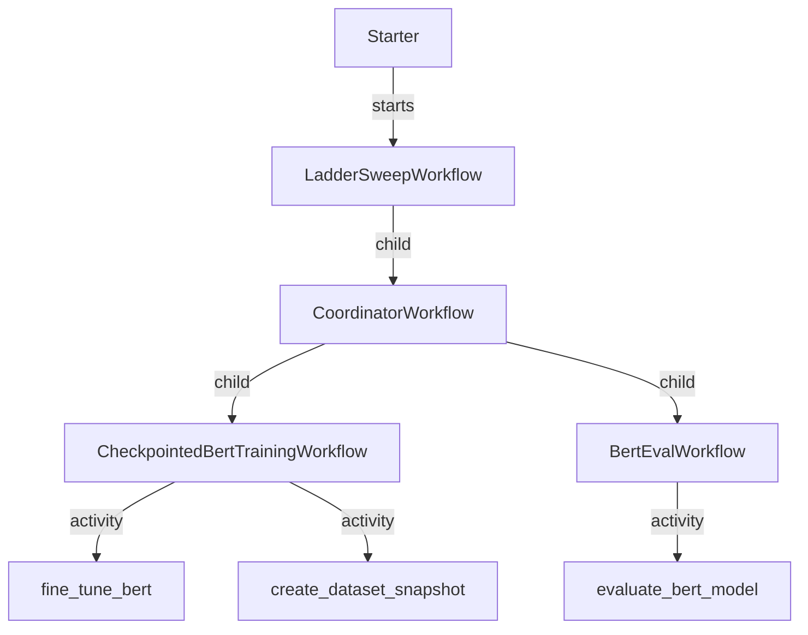

<!--
description: Build durable custom hyperparameter optimization to save money
tags: [ML Ops, HPO, autoML, python]
priority: 700
-->

# BERT Hyperparameter Sweeps (Temporal + Transformers)
This recipe shows how to run durable, replay‑safe hyperparameter sweeps where each trial is a full training + eval pipeline. If you’re new to Temporal, this is a good “first production‑style workflow” example: every trial is resilient to worker crashes, checkpoints are tracked in workflow state, and the sweep logic stays deterministic even as it explores a search space.

You’ll learn how to use Temporal to orchestrate long‑running ML workflows without glue code, why workflow determinism matters, and how to scale training and evaluation independently. Temporal’s durability and replay mean you can resume sweeps after crashes without losing trial state or re‑running completed work. The fast preset targets <2 minutes on a laptop so you can try it without draining your battery.

---

**Quickstart**
1. Start Temporal Server (if not already running):
```bash
temporal server start-dev
```

2. Install deps and start the workers:
```bash
uv sync --dev
uv run -m training_worker
uv run -m worker
```

3. Run a fast, laptop‑friendly sweep (target <2 minutes on a MacBook):
```bash
uv run -m starter --config fast
```

4. Run a larger ladder sweep:
```bash
uv run -m starter --config ladder
```

---

**What You’ll See In Temporal**
1. In Temporal Web, filter by Workflow Type `LadderSweepWorkflow` or search for Workflow ID starting with `bert-ladder-`.
2. Open the parent workflow, then use “Child Workflows” to drill into:
`CoordinatorWorkflow` → `CheckpointedBertTrainingWorkflow` and `BertEvalWorkflow`.
3. If you’re unsure where to look, start at the parent and follow the child chain. That’s the sweep tree.

---

**How It Works**
1. `starter.py` chooses a preset sweep request and starts `LadderSweepWorkflow`.
2. `LadderSweepWorkflow` proposes configs in stages and calls `CoordinatorWorkflow`.
3. `CoordinatorWorkflow` runs one training workflow per config, then evaluation.
4. Training and evaluation run on separate task queues so you can scale them independently.



---

**Customize In 3 Edits**
If you only change one file, change `ml_ops/hyperparam_optimization/configs.py`:
1. Model + dataset: edit `BertFineTuneConfig(model_name=..., dataset_name=..., dataset_config_name=...)`
2. Search space: edit `SweepSpace(learning_rate=..., batch_size=..., max_seq_length=..., num_epochs=...)`
3. Budget: edit `num_trials`, `max_concurrency`, `max_train_samples`

**Minimum Files To Copy**
If you want to lift this pattern into your own repo, start with:
- `ml_ops/hyperparam_optimization/custom_types.py`
- `ml_ops/hyperparam_optimization/bert_activities.py` (replace with your train/eval logic)
- `ml_ops/hyperparam_optimization/workflows.py`
- `ml_ops/hyperparam_optimization/configs.py`
- `ml_ops/hyperparam_optimization/starter.py` (optional, if you want the CLI entrypoint)

**Copy/Paste Config Knobs**
Use `ml_ops/hyperparam_optimization/configs.py` to create your own presets. The most common knobs are:
- `num_trials` and `max_concurrency` in `SweepRequest`
- `max_train_samples`, `num_epochs`, `batch_size`, `max_seq_length`, `learning_rate` in `BertFineTuneConfig`
- `max_eval_samples` and `batch_size` in `BertEvalRequest`

If you want a fast local run, start with:
- `num_trials=3`
- `max_concurrency=1`
- `num_epochs=1`
- `max_train_samples=300`

**JSON Config (Optional)**
You can also pass a JSON file so users can copy/paste a minimal config without editing Python:
```bash
uv run -m starter --config-file path/to/sweep.json
```

A ready-to-edit template lives at `ml_ops/hyperparam_optimization/sweep.json`.

Example `sweep.json` (minimal):
```json
{
  "experiment_id": "my-sweep",
  "num_trials": 3,
  "max_concurrency": 1,
  "seed": 42,
  "base": {
    "fine_tune_config": {
      "model_name": "bert-base-uncased",
      "dataset_name": "glue",
      "dataset_config_name": "sst2",
      "num_epochs": 1,
      "batch_size": 2,
      "learning_rate": 2e-5,
      "max_seq_length": 64,
      "use_gpu": false,
      "max_train_samples": 300,
      "max_eval_samples": 200,
      "shuffle_before_select": true,
      "seed": 42
    },
    "evaluation_config": {
      "dataset_name": "glue",
      "dataset_config_name": "sst2",
      "split": "validation",
      "max_eval_samples": 200,
      "max_seq_length": 64,
      "batch_size": 8,
      "use_gpu": false,
      "seed": 42
    }
  },
  "space": {
    "learning_rate": [1e-5, 5e-5],
    "batch_size": [2, 4],
    "max_seq_length": [64, 128],
    "num_epochs": [1, 2]
  }
}
```

**Adapting To Other Models**
If you want to optimize something other than BERT fine‑tuning, you can keep the Temporal workflows and replace the activity logic.
The smallest surface area to change is:
1. `ml_ops/hyperparam_optimization/custom_types.py`: define your `TrainingConfig` and `EvalRequest`.
2. `ml_ops/hyperparam_optimization/bert_activities.py`: swap `fine_tune_bert` and `evaluate_bert_model` with your training/eval functions.
3. `ml_ops/hyperparam_optimization/configs.py`: update the `base` config and `SweepSpace`.

Minimal shape of a custom training activity (pseudocode):
```python
@activity.defn(name="fine_tune_bert")
async def train_model(request: TrainingRequest) -> TrainingResult:
    # Load data
    # Train for request.config.num_epochs
    # Save artifacts under ./runs/<run_id>
    # Return metrics needed for selection
    ...
```

Example: Swap in a scikit‑learn model (logistic regression on a CSV)
```python
from dataclasses import dataclass
from pathlib import Path
import joblib
import pandas as pd
from sklearn.linear_model import LogisticRegression
from sklearn.metrics import accuracy_score
from temporalio import activity

@dataclass
class SklearnConfig:
    csv_path: str
    target_col: str
    C: float
    max_iter: int

@dataclass
class SklearnRequest:
    run_id: str
    config: SklearnConfig

@dataclass
class SklearnResult:
    run_id: str
    accuracy: float
    model_path: str

@activity.defn(name="fine_tune_bert")
async def train_sklearn(request: SklearnRequest) -> SklearnResult:
    df = pd.read_csv(request.config.csv_path)
    y = df[request.config.target_col]
    X = df.drop(columns=[request.config.target_col])
    model = LogisticRegression(C=request.config.C, max_iter=request.config.max_iter)
    model.fit(X, y)
    preds = model.predict(X)
    acc = float(accuracy_score(y, preds))
    out_dir = Path("./runs") / request.run_id
    out_dir.mkdir(parents=True, exist_ok=True)
    model_path = str(out_dir / "model.joblib")
    joblib.dump(model, model_path)
    return SklearnResult(run_id=request.run_id, accuracy=acc, model_path=model_path)
```

Note: if you rename the activity (e.g. `train_model`), update the activity names in
`ml_ops/hyperparam_optimization/workflows.py` to match (`execute_activity("fine_tune_bert", ...)`).

---

**Where Outputs Go**
- Checkpoints and models: `./bert_runs/<run_id>/checkpoint-*`
- Dataset snapshots: `./data_snapshots/<snapshot_id>/`

The workflow keeps the latest checkpoint path in state, so it can resume after worker restarts without scanning the filesystem.

---

**Logs And Progress**
You do not need to hit Ctrl+C to see logs. Watch the terminal running `training_worker.py` for training progress and loss. The `starter.py` output only prints the final summary.

If you want more frequent updates, lower `logging_steps` in `bert_activities.py` or enable TensorBoard by setting `report_to=["tensorboard"]` and `logging_dir`.

---

**Troubleshooting**
- Seeing `MISSING` / `UNEXPECTED` keys in logs:
This is normal when loading a base model into a different task head. It’s not a failure.
- GPU pegged or slow progress:
Use the `fast` preset or reduce `num_trials`, `max_concurrency`, and `max_train_samples`.
- Missing ML deps:
If you see “BERT checkpointing dependencies are not installed,” install `transformers`, `datasets`, and `torch`.

---

**Scaling Out**
For distributed runs, you need shared storage for `./bert_runs` and `./data_snapshots`, or you can switch those paths to object storage. On cloud, that typically means NFS/EFS/Lustre or an S3/GCS backed artifact store.

---

**More Detail**
- Architecture deep dive: `ml_ops/hyperparam_optimization/docs/architecture.md`
- Competitive comparison: `ml_ops/hyperparam_optimization/docs/competitive-comparison.md`
